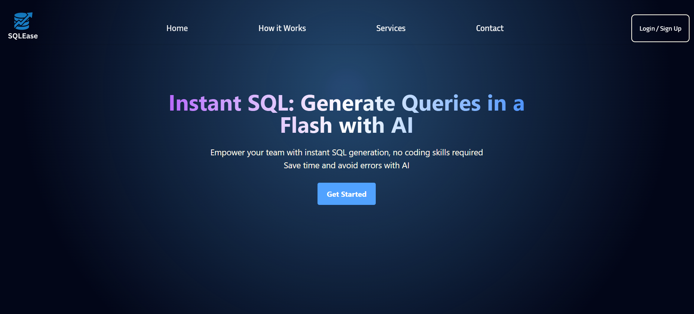
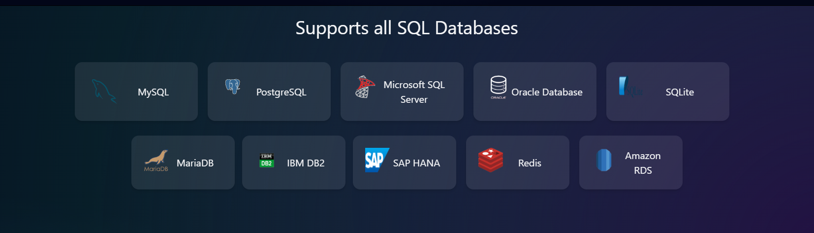
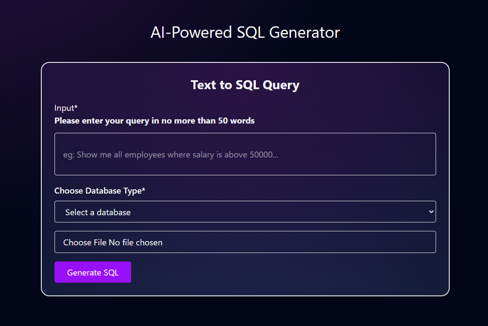

<h1 align="center">⚡ SQLEase - AI Powered SQL Generator ⚡</h1>

  
  
  
  

  <b>Turn simple words into powerful SQL queries. Let the AI handle the syntax. 🚀</b>

---

  

---

## 🌐 Website

Check out the live version of SQLEase here: [https://sql-ease.vercel.app/](https://sql-ease.vercel.app/)

## 🎯 What is SQLEase?

**SQLEase** is a smart, user-friendly tool that uses AI to convert plain English into precise SQL queries. Whether you're a developer, analyst, or student, SQLEase makes data querying effortless—even if you're not fluent in SQL.

---

## ✨ Features

| 🔹 Feature                    | 💡 Description |
|-----------------------------|----------------|
| 🗣️ Natural Language Input    | Ask questions like “List all orders over $500” |
| 🧠 AI-Powered SQL Generation | Generates accurate SQL queries instantly |
| 🗃️ Database Type Selection   | Choose from MySQL, PostgreSQL, SQLite, etc. |
| 📁 CSV Upload                | Load your own CSV data as a database |
| ⚙️ Query Execution           | See results generated from your CSV |
| 💻 Clean & Responsive UI     | Simple and elegant interface for all users |

---

## 🚀 How It Works

1. ✏️ **Type a natural language question**  
   Example: _"Show all students who scored above 90"_

2. 🧩 **Pick your Database Type**  
   Select from options like MySQL, PostgreSQL, SQLite.

3. 📂 **Upload your CSV File**  
   Use your own data—no database setup needed.

4. 🧠 **Click Generate**  
   Watch the AI turn your sentence into a valid SQL query.

5. 📈 **View the Results**  
   Get instant results based on your uploaded CSV data.

---

## 🖼️ Screenshots

- ✅ Supports All types of Database queries

  

  
    
  

  

  
- ✅ Responsive and interactive UI
 
- ✅ SQL generation from natural queries  

- ✅ Output results based on CSV data

    
    
  

  

---

## 🧰 Tech Stack

- **Frontend**: React.Js, TailwindCSS
- **Backend**: Flask(Python)
- **AI/NLP**: Google Gemini API - gemini-1.5 Pro
- **Data Handling**: SQLite3
- **Other**: File upload, query parser, CSV-to-DB loader, Prompting

---

## 📄 License

This project is licensed under the **MIT License**.

You are free to:

- ✅ Use
- ✅ Copy
- ✅ Modify
- ✅ Merge
- ✅ Publish
- ✅ Distribute
- ✅ Sub-license
- ✅ Sell copies of the Software

As long as you include the original license and copyright.

> See the full license text in the [LICENSE](./LICENSE) file.
